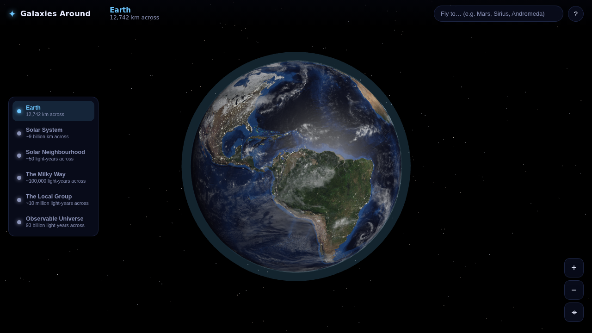
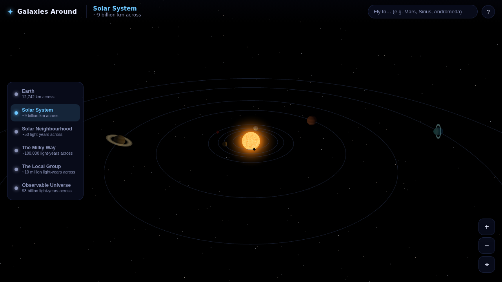
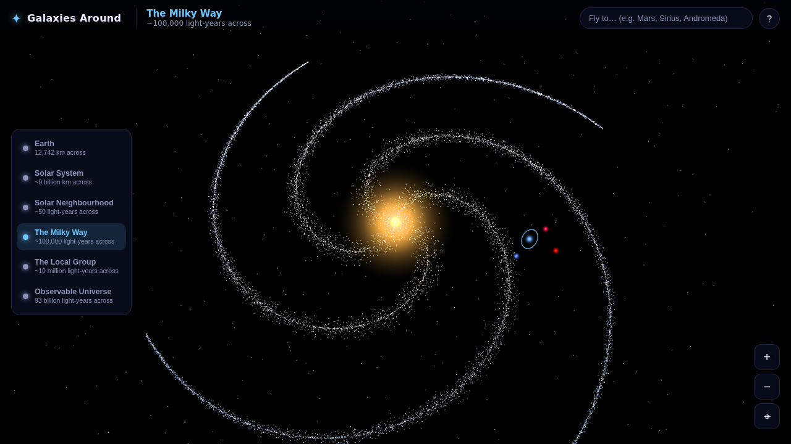
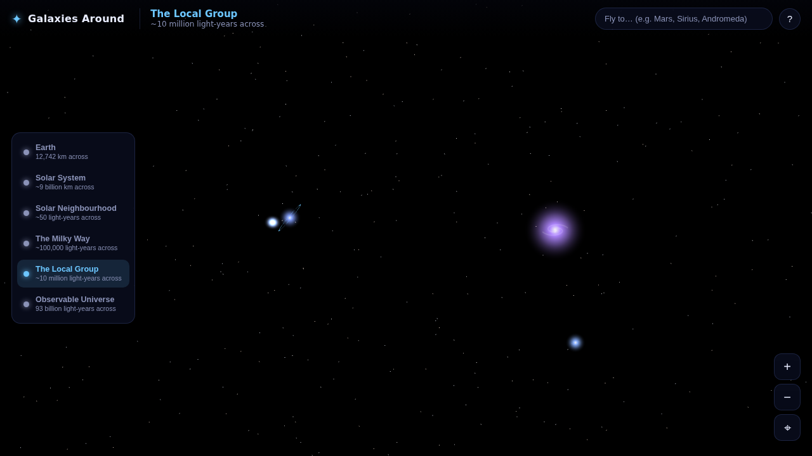
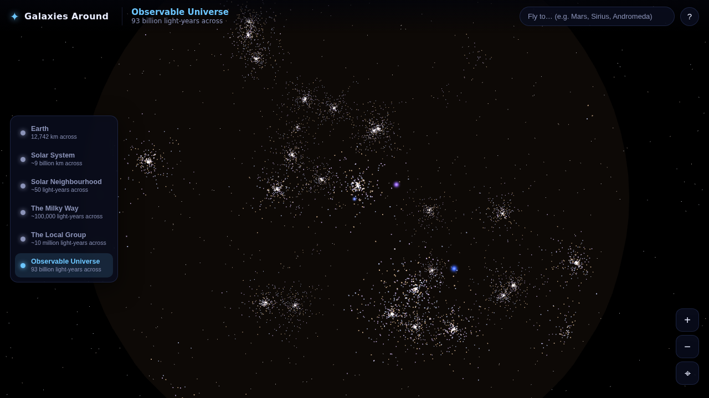
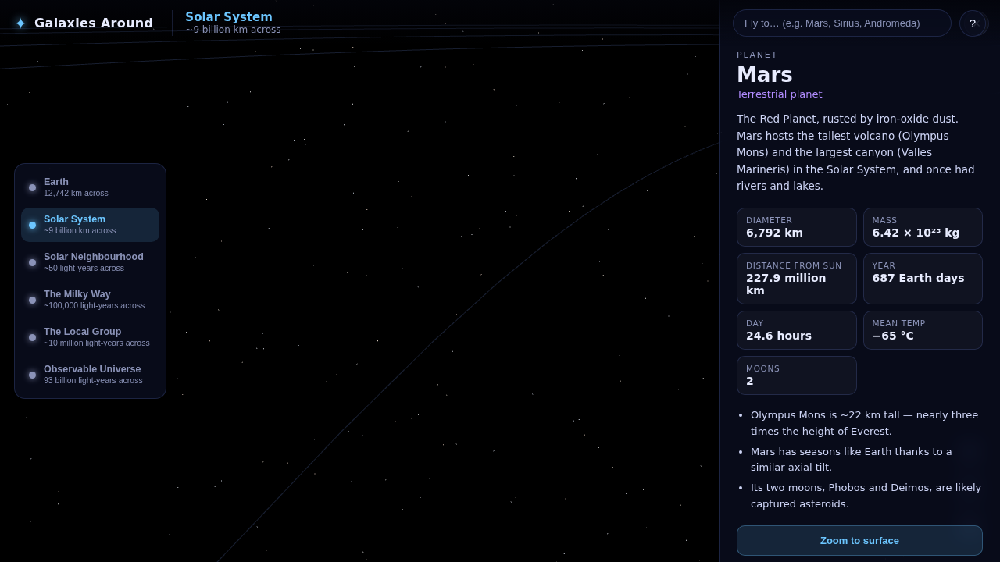
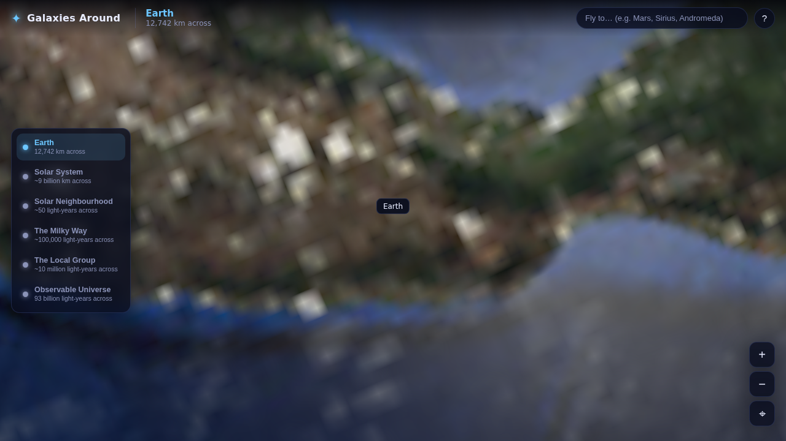

<div align="center">

# ✦ Galaxies Around

### An interactive universe simulator — from your backyard to the edge of everything.

Fly from **Earth** out through the **Solar System**, past the **nearest stars**, across the
**Milky Way**, into the **Local Group**, and all the way to the **observable universe** —
zooming, clicking and exploring real worlds with facts straight from **NASA**.

<br />



<br />

[**▶ Live demo**](#-quick-start) · [Features](#-features) · [Controls](#-controls) · [The six scales](#-the-six-cosmic-scales) · [Project structure](#-project-structure)

</div>

---

## 🌌 What is this?

**Galaxies Around** is a browser-based, real-time 3D simulator that lets you travel across **27 orders of magnitude** — from the 12,742 km of planet Earth to the 93-billion-light-year span of the observable universe — in one continuous, clickable experience.

Every planet, star and galaxy is **clickable**: fly to it, read its NASA fact sheet, and zoom right down onto its surface. Scroll out far enough and the simulator smoothly hands you off to the next cosmic scale.

No installation, no build step, **no internet required** — Three.js is vendored locally and every texture is generated procedurally in your browser.

<div align="center">

| Solar System | The Milky Way |
|:---:|:---:|
|  |  |
| **Local Group** | **Observable Universe** |
|  |  |

</div>

## ✨ Features

- 🪐 **Six seamless scales** — Earth → Solar System → Solar Neighbourhood → Milky Way → Local Group → Observable Universe, with smooth zoom-driven transitions between them.
- 🖱️ **Click anything** — every planet, star, galaxy and structure is selectable. Click to fly to it and open its info panel.
- 📖 **Real NASA data** — diameters, masses, distances, orbital periods, temperatures and fun facts, each linked back to the relevant NASA page.
- 🛰️ **Zoom to the surface** — drop down onto planetary surfaces, or dive *inside* the Milky Way and the Local Group.
- 🔭 **Smart zoom** — scroll/pinch to zoom in and out; cross a scale boundary and you're carried to the next level automatically.
- 🧭 **Scale ladder + search** — jump straight to any scale, or type a name ("Mars", "Sirius", "Andromeda") to fly there instantly.
- 🌍 **Photorealistic Earth & Moon** — real NASA Blue Marble imagery with terrain relief, glinting oceans, a live cloud layer and city lights glowing on the night side. Gas giants, the Sun, galaxies and the cosmic web are generated procedurally — everything ships with the repo and works offline.
- ⚡ **Zero build, zero dependencies to install** — just open it in a modern browser.

<div align="center">



*Click any body for a NASA-sourced fact sheet — and a button to zoom onto its surface.*



*Zoom all the way down: real NASA satellite imagery, right to the coastline.*

</div>

## 🚀 Quick start

Because the app uses ES modules, it needs to be served over `http://` (not opened as a `file://`). Any static server works — use whichever you already have installed:

```bash
# clone
git clone https://github.com/AbdelrahmanDesOki/galaxies-around.git
cd galaxies-around

# then serve with ANY ONE of these:
python -m http.server 8080     # Python 3 (already on most systems)
python3 -m http.server 8080    # Python 3 (if `python` isn't found)
php -S localhost:8080          # PHP
npx http-server -p 8080        # Node.js (npx ships with Node — install from nodejs.org)
```

No terminal? In **VS Code**, install the **Live Server** extension, then right-click `index.html` → **Open with Live Server**.

Now open **http://localhost:8080** and start exploring. 🌠

> ⚠️ Don't open `index.html` directly as a `file://` page — browsers block ES-module loading over `file://`, so it must be served over `http://`.

## 🎮 Controls

| Action | What it does |
|---|---|
| **Scroll / pinch** | Zoom in and out — cross an edge to jump to the next cosmic scale |
| **Drag** | Orbit the view |
| **Right-drag** | Pan |
| **Click** an object | Fly to it and open its NASA info panel |
| **Scale ladder** (left) | Jump directly to any of the six scales |
| **Search** (top right) | Fly to any named planet, star or galaxy |
| **＋ / − / ⌖** (right) | Zoom in, zoom out, reset the view |

## 🔭 The six cosmic scales

| # | Scale | Span | Highlights |
|:--:|---|---|---|
| 0 | **Earth** | ~12,700 km | Textured globe, drifting clouds, the orbiting Moon, zoom to surface |
| 1 | **Solar System** | ~9 billion km | The Sun + 8 planets on real-ratio orbits, Saturn's rings, live motion |
| 2 | **Solar Neighbourhood** | ~50 light-years | Proxima Centauri, Sirius, Barnard's Star, Vega and other near stars |
| 3 | **The Milky Way** | ~100,000 light-years | Spiral arms, Sgr A\*, the Orion Arm, and *"you are here"* |
| 4 | **The Local Group** | ~10 million light-years | Andromeda, Triangulum, the Magellanic Clouds |
| 5 | **Observable Universe** | 93 billion light-years | The cosmic web, Virgo & Laniakea superclusters, the CMB edge |

## 🗂️ Project structure

```
Galaxies-Around/
├── index.html              # Entry point + import map (Three.js vendored locally)
├── css/style.css           # HUD, panels and space-themed styling
├── js/
│   ├── main.js             # Engine: renderer, camera, scale management, picking, fly-to
│   ├── ui.js               # HUD layer: info panel, scale ladder, tooltip, search
│   ├── data/               # NASA fact sheets (the source of truth)
│   │   ├── solarSystem.js   #   Sun, planets, the Moon
│   │   ├── stars.js         #   nearby stars + galactic landmarks
│   │   └── galaxies.js      #   Milky Way, Local Group, cosmic structures
│   ├── engine/             # Reusable rendering toolkit
│   │   ├── textures.js      #   procedural canvas textures (planets, sun, galaxies)
│   │   ├── objects.js       #   factories: bodies, orbits, starfields, spiral galaxies
│   │   └── interactive.js   #   click/hover targets and markers
│   └── levels/             # One module per cosmic scale
│       ├── earth.js · solarSystem.js · interstellar.js
│       └── milkyWay.js · localGroup.js · observableUniverse.js
└── vendor/three/           # Three.js r160 (vendored — no CDN, works offline)
```

The design is deliberately **data-driven**: to add or correct a body, edit a record in `js/data/` — the renderer and info panel pick it up automatically.

## 📊 Data sources

All figures are drawn from public NASA / JPL resources, including:

- [NASA Planetary Fact Sheets (NSSDC)](https://nssdc.gsfc.nasa.gov/planetary/factsheet/)
- [NASA Science — Solar System & Universe](https://science.nasa.gov/)
- [NASA / ESA imagery and the Gaia stellar catalogue](https://science.nasa.gov/mission/hubble/)
- Earth & Moon texture maps: NASA Blue Marble / Visible Earth, via the MIT-licensed [three.js examples](https://github.com/mrdoob/three.js/tree/master/examples/textures/planets) (vendored in `assets/textures/planets/`)

> **A note on scale:** the *real* universe is overwhelmingly empty space. Distances and sizes are gently compressed so that everything stays visible and explorable — the facts in every panel, however, are real.

## 🛠️ Built with

- [**Three.js**](https://threejs.org/) (r160) for WebGL rendering — vendored locally
- Vanilla **JavaScript ES modules** — no framework, no bundler
- 100% procedural textures via the Canvas API

## 📜 License

Released under the [MIT License](LICENSE). Explore freely. 🌟

<div align="center">
<br />
<i>"For small creatures such as we, the vastness is bearable only through love."</i><br />
— Carl Sagan
</div>
